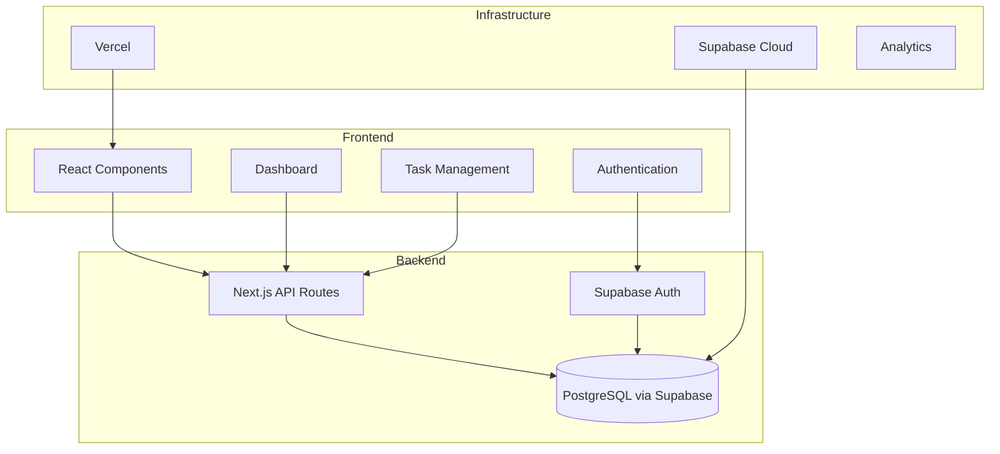

# PROJECT PLAN - SIMPLE TASK TRACKER

## 📋 Project Overview

### Project Information
- **Project ID**: STT-2024-001
- **Project Name**: Simple Task Tracker
- **Category**: SaaS Productivity Tool
- **Priority**: HIGH
- **Complexity**: Low-Medium
- **Estimated Timeline**: 14 days
- **Budget Allocation**: $0 (using free tiers)

### Project Description
Simple Task Tracker adalah aplikasi SaaS task management yang dirancang untuk menguji kehandalan sistem agentik kita dari initiation hingga deployment. Fokus utama adalah kesederhanaan dan efisiensi tanpa fitur yang berlebihan.

### Business Problem
- Task management tools existing terlalu kompleks
- User overwhelmed dengan fitur yang tidak dibutuhkan
- Learning curve yang curam untuk tools sederhana
- Harga yang tinggi untuk fungsi dasar

### Solution Overview
Task management sederhana dengan 5 core features:
1. User Authentication
2. Task CRUD Operations  
3. Simple Dashboard
4. Basic Search
5. Export to CSV

## 🎯 Project Objectives

### Primary Testing Objectives
1. **Agent Coordination Testing** - Validasi komunikasi antar 6 agent (PM + A01-A06)
2. **Git Workflow Validation** - Test branching strategy dan commit conventions
3. **Quality Gate Enforcement** - Verifikasi QA audit dan revision loop
4. **End-to-End Pipeline** - Dari brief hingga deployment dalam satu siklus penuh
5. **Performance Benchmarking** - Mengukur waktu dan kualitas setiap fase

### Secondary Testing Objectives
1. **Error Handling Validation** - Test conflict resolution dan emergency override
2. **Documentation Completeness** - Verifikasi artifact generation di setiap fase
3. **Decision Making Process** - Validasi keputusan berbasis data vs opinion
4. **Resource Allocation** - Test efisiensi penggunaan sumber daya

## 🎯 Success Metrics & KPIs

### System Health Metrics
- **Agent Success Rate**: >95% agents complete tasks without errors
- **Pipeline Efficiency**: <24 hours between agent handoffs
- **Quality Gate Compliance**: 100% QA audit completion
- **Git Workflow Integrity**: 0 merge conflicts, 100% conventional commits

### Project Success Metrics
- **Kill Metric**: "50 active users within 2 weeks post-launch"
- **Timeline**: "Complete development in 14 days"
- **Quality**: "Lighthouse score >90 for all pages"
- **Security**: "0 critical vulnerabilities in QA audit"
- **Performance**: "<2 seconds page load time"

### Learning Metrics
- **Process Documentation**: Complete artifact generation (100%)
- **Lessons Learned**: 10+ process improvements identified
- **System Reliability**: <5% manual intervention required

## 📅 Project Timeline

### Phase 1: Research & Strategy (Day 1-2)
**Duration**: 2 days
**Start**: 2024-11-18
**End**: 2024-11-19

**Activities**:
- Market research untuk task management tools
- Competitor analysis (Trello, Asana, Monday.com)
- User persona definition
- Value proposition formulation
- Tech stack recommendation

**Deliverables**:
- RESEARCH_STRATEGY_BLUEPRINT.md
- Market analysis report
- Competitor comparison matrix
- Tech stack recommendation

**Owner**: SAAS_AGENT_01 (Research)

### Phase 2: Design & Validation (Day 3-4)
**Duration**: 2 days
**Start**: 2024-11-20
**End**: 2024-11-21

**Activities**:
- UX/UI design untuk 5 core features
- Wireframe creation
- Design system definition
- User flow mapping
- Brand identity development

**Deliverables**:
- DESIGN_UX_BLUEPRINT.md
- Wireframes for all screens
- Design system documentation
- User flow diagrams

**Owner**: SAAS_AGENT_02 (Design)

### Phase 3: Development & Production (Day 5-10)
**Duration**: 6 days
**Start**: 2024-11-22
**End**: 2024-11-27

**Activities**:
- Backend development (API, database)
- Frontend development (UI components)
- Authentication system
- Task CRUD implementation
- Dashboard development
- Search functionality
- Export feature

**Deliverables**:
- PRODUCTION_REPORT.md
- Complete source code
- Database schema
- API documentation

**Owner**: SAAS_AGENT_03 (Production)

### Phase 4: Testing & Quality Assurance (Day 11-12)
**Duration**: 2 days
**Start**: 2024-11-28
**End**: 2024-11-29

**Activities**:
- Functional testing
- Security audit
- Performance testing
- User acceptance testing
- Code quality review

**Deliverables**:
- LAPORAN_AUDIT.md
- Test results documentation
- Security assessment
- Performance benchmarks

**Owner**: SAAS_AGENT_04 (QA)

### Phase 5: Deployment & Launch (Day 13-14)
**Duration**: 2 days
**Start**: 2024-11-30
**End**: 2024-12-01

**Activities**:
- Production deployment
- Monitoring setup
- User testing
- Performance validation
- Launch preparation

**Deliverables**:
- HANDOFF_TO_PM_AGENT.md
- FINAL_REPORT.md
- Deployment documentation
- Monitoring dashboard

**Owner**: SAAS_AGENT_05 (Deployment)

## 🏗️ Technical Architecture

### System Components

### Technology Stack
- **Frontend**: Next.js 14 with React
- **Backend**: Next.js API Routes
- **Database**: PostgreSQL via Supabase
- **Authentication**: Supabase Auth
- **Styling**: Tailwind CSS
- **Deployment**: Vercel
- **Monitoring**: Vercel Analytics

### Data Flow
1. **User Authentication** → Supabase Auth → JWT Token
2. **Task Operations** → API Routes → PostgreSQL
3. **Dashboard Data** → API Queries → React Components
4. **Export Function** → CSV Generation → Download

## 🎯 Risk Assessment & Mitigation

### Technical Risks
1. **Agent Coordination Failure**
   - Probability: Medium
   - Impact: High
   - Mitigation: Clear handoff protocols, monitoring systems

2. **Git Workflow Issues**
   - Probability: Low
   - Impact: Medium
   - Mitigation: Conventional commits enforcement, branch protection

3. **Quality Gate Failures**
   - Probability: Medium
   - Impact: High
   - Mitigation: Clear QA criteria, revision loop protocols

### Project Risks
4. **Timeline Delays**
   - Probability: Medium
   - Impact: Medium
   - Mitigation: Parallel development, buffer time

5. **Resource Constraints**
   - Probability: Low
   - Impact: Low
   - Mitigation: Free tier usage, efficient resource allocation

## 💰 Resource Requirements

### Human Resources
- **Project Manager**: 1 person (full-time)
- **SAAS_AGENT_01**: 1 person (part-time, research)
- **SAAS_AGENT_02**: 1 person (part-time, design)
- **SAAS_AGENT_03**: 1 person (full-time, development)
- **SAAS_AGENT_04**: 1 person (part-time, QA)
- **SAAS_AGENT_05**: 1 person (part-time, deployment)
- **SAAS_AGENT_06**: 1 person (part-time, monitoring)

### Technical Resources
- **Development Environment**: Local development setup
- **Staging Environment**: Vercel preview deployments
- **Production Environment**: Vercel (free tier)
- **Database**: Supabase (free tier)
- **Monitoring**: Vercel Analytics (free)

### External Services
- **Hosting**: Vercel (free tier)
- **Database**: Supabase (free tier)
- **Authentication**: Supabase Auth (free tier)
- **Analytics**: Vercel Analytics (free)

## 📋 Project Governance

### Decision Making
- **Technical Decisions**: SAAS_AGENT_03 + PM Agent
- **Design Decisions**: SAAS_AGENT_02 + PM Agent
- **Quality Decisions**: SAAS_AGENT_04 + PM Agent
- **Go/No-Go Decisions**: PM Agent based on agent inputs

### Quality Gates
- **Phase Completion**: Each phase must meet exit criteria
- **Agent Validation**: Each agent must validate input from previous agent
- **Code Review**: All code must pass quality checks
- **Security**: Security assessment must be passed
- **Performance**: Performance targets must be met

### Change Management
- **Scope Changes**: PM Agent approval required
- **Timeline Changes**: PM Agent + affected agents approval
- **Technical Changes**: SAAS_AGENT_03 recommendation + PM Agent approval

## 📈 Expected Benefits

### System Benefits
- **Validated Agent Coordination**: Proven 6-agent workflow
- **Documented Processes**: Clear SOPs for future projects
- **Performance Benchmarks**: Baseline metrics for comparison
- **Quality Standards**: Established quality gates and criteria

### Learning Benefits
- **Process Optimization**: Identification of bottlenecks and improvements
- **Team Coordination**: Enhanced inter-agent communication
- **Risk Management**: Validated mitigation strategies
- **Documentation**: Comprehensive project documentation

### Technical Benefits
- **Git Workflow**: Proven branching and commit strategies
- **Deployment Pipeline**: Automated deployment processes
- **Monitoring Systems**: Real-time progress tracking
- **Quality Assurance**: Systematic testing and validation

## 📚 Documentation Plan

### Project Documentation
- **PROJECT_PLAN.md**: Master project plan (this file)
- **RESEARCH_STRATEGY_BLUEPRINT.md**: Research findings and strategy
- **DESIGN_UX_BLUEPRINT.md**: Design specifications and wireframes
- **PRODUCTION_REPORT.md**: Development progress and code documentation
- **LAPORAN_AUDIT.md**: Quality assurance and testing results
- **FINAL_REPORT.md**: Project summary and lessons learned

### Technical Documentation
- **API Documentation**: Complete API reference
- **Database Schema**: Data model documentation
- **Deployment Guide**: Step-by-step deployment instructions
- **Monitoring Guide**: System monitoring and alerting

## 🎯 Next Steps

### Immediate Actions (Day 1)
1. **Project Setup**: Create repository and folder structure
2. **Team Briefing**: Align all agents on objectives
3. **Research Initiation**: Start SAAS_AGENT_01 research phase
4. **Monitoring Setup**: Initialize progress tracking systems

### Short-term Actions (Days 2-7)
1. **Research Completion**: Market analysis and competitor research
2. **Design Phase**: UX/UI design and wireframes
3. **Development Start**: Backend and frontend development
4. **Regular Check-ins**: Daily progress updates

### Long-term Actions (Days 8-14)
1. **Testing Phase**: Comprehensive QA and testing
2. **Deployment**: Production deployment and monitoring
3. **Launch**: Public launch and user acquisition
4. **Analysis**: Performance analysis and lessons learned

---

**Project Manager**: PM Agent v3.2  
**Created**: 2024-11-18T11:59:00Z  
**Status**: INITIATED  
**Next Review**: 2024-11-19T11:59:00Z