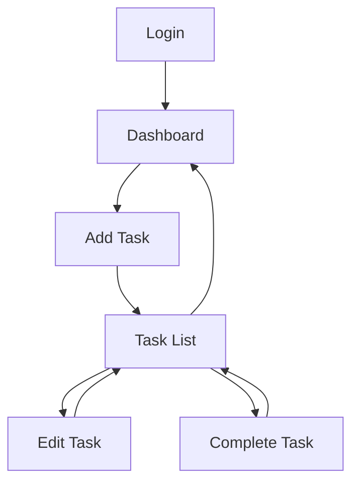
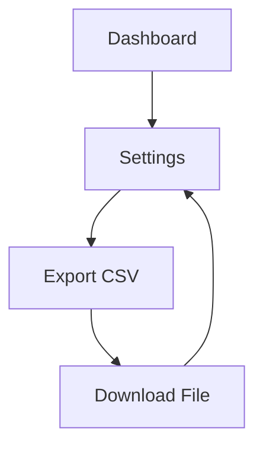

# Simple Task Tracker - Design & UX Blueprint

**Tanggal Design:** 2024-11-18 12:06:00 +0000

---

## 📋 RINGKASAN DESAIN

### **Project Brief dari SAAS_AGENT_01**
- **Value Proposition:** Simple task management untuk teams dan individuals yang ingin fokus pada completion tanpa distraksi fitur berlebihan
- **Target Persona:** 25-45 tahun, remote workers, small business owners, students yang value simplicity
- **Brand Foundation:** Sage archetype, simple/clear/helpful tone
- **Technical Constraints:** 5 core features only, Next.js 14 + Supabase + Vercel stack

### **Design Philosophy**
**"Less is More"** - Setiap elemen harus memiliki tujuan jelas dan mendukung task completion tanpa distraksi.

---

## 🎨 DESIGN SYSTEM

### **Color Palette**
```yaml
Primary Colors:
  - Blue #2563EB (Primary actions, links)
  - Gray #6B7280 (Secondary text, borders)
  - White #FFFFFF (Background, cards)

Semantic Colors:
  - Green #10B981 (Success, completed tasks)
  - Red #EF4444 (Error, delete actions)
  - Yellow #F59E0B (Warning, due dates)

Usage Guidelines:
  - Blue digunakan hanya untuk primary CTAs
  - Gray untuk secondary elements
  - Green hanya untuk task completion feedback
  - Red hanya untuk destructive actions
```

### **Typography**
```yaml
Font Family: Inter (system font stack)
Font Sizes:
  - Headline: 24px, weight 600
  - Subheading: 18px, weight 500
  - Body: 16px, weight 400
  - Small: 14px, weight 400
  - Caption: 12px, weight 400

Line Height:
  - Body: 1.5
  - Headings: 1.2

Usage: Clean, readable, minimal hierarchy
```

### **Component Library**
```yaml
Buttons:
  - Primary: Blue background, white text, 8px padding
  - Secondary: White background, blue border, blue text
  - Ghost: Transparent background, blue text
  - Size: Small (32px height), Medium (40px), Large (48px)

Inputs:
  - Text fields: Gray border, 4px radius, 8px padding
  - Focus state: Blue border, subtle shadow
  - Error state: Red border
  - Placeholder: Light gray text

Cards:
  - Task cards: White background, gray border, 8px radius
  - Hover effect: Subtle shadow
  - Padding: 16px
  - Margin: 8px between cards
```

---

## 📱 SCREEN DESIGNS

### **Screen 1: Login/Register**
```yaml
Layout: Centered form, minimal branding
Elements:
  - Logo (simple text "Simple Task Tracker")
  - Email input field
  - Password input field
  - Primary CTA "Sign In"
  - Secondary link "Create account"
  - Forgot password link

User Flow:
  1. Enter email/password
  2. Click "Sign In"
  3. Redirect to Dashboard

Design Notes:
  - No social login (simplicity focus)
  - Minimal form validation
  - Clear error states
```

### **Screen 2: Dashboard**
```yaml
Layout: Clean, task-focused
Elements:
  - Header: "My Tasks", user avatar, logout
  - Quick Add: "Add new task" button (primary)
  - Task List: Scrollable task cards
  - Filter tabs: "All", "Active", "Completed"
  - Stats: Simple count (5 active, 12 completed)

User Flow:
  1. View all tasks at glance
  2. Quick add new task
  3. Filter tasks by status
  4. Click task to edit

Design Notes:
  - No charts/graphs (distracting)
  - Task count only (simple metrics)
  - Prominent "Add" button
```

### **Screen 3: Task List**
```yaml
Layout: Vertical task cards
Elements:
  - Task cards with title, due date, status
  - Checkbox for completion
  - Edit button (secondary)
  - Delete button (ghost)
  - Search bar at top
  - Sort options (date, priority)

Task Card Structure:
  - Left: Checkbox
  - Center: Task title, due date
  - Right: Actions (edit, delete)
  - Bottom: Tags (optional)

Design Notes:
  - Minimal information per card
  - Clear completion feedback
  - Swipe gestures for mobile
```

### **Screen 4: Task Detail/Edit**
```yaml
Layout: Single task focus
Elements:
  - Task title (editable)
  - Description (textarea)
  - Due date picker
  - Priority selector (Low/Medium/High)
  - Status toggle (Active/Completed)
  - Save button (primary)
  - Cancel button (secondary)
  - Delete button (ghost, red)

User Flow:
  1. Edit task details
  2. Change status/priority
  3. Save or cancel
  4. Return to task list

Design Notes:
  - One task per screen (focus)
  - Minimal fields
  - Auto-save on change
```

### **Screen 5: Settings**
```yaml
Layout: Simple preferences
Elements:
  - Profile section (name, email)
  - Theme selector (Light/Dark)
  - Notifications toggle
  - Export button (CSV)
  - About section
  - Logout button

User Flow:
  1. Access settings from dashboard
  2. Modify preferences
  3. Export data if needed
  4. Logout

Design Notes:
  - Minimal settings (simplicity)
  - No integrations (phase 1)
  - Clear data export
```

---

## 🔄 USER FLOW DIAGRAMS

### **Primary User Flow: Task Management**


### **Secondary User Flow: Data Export**


---

## 📐 RESPONSIVE DESIGN

### **Breakpoints**
```yaml
Mobile: 320px - 768px
Tablet: 768px - 1024px
Desktop: 1024px+
```

### **Mobile Adaptations**
```yaml
Navigation:
  - Bottom navigation (tab bar)
  - Hamburger menu for settings
  - Swipe gestures for task actions

Layout:
  - Single column layout
  - Larger touch targets (44px minimum)
  - Simplified forms

Task Cards:
  - Full-width cards
  - Swipe left for complete
  - Swipe right for delete
```

### **Desktop Enhancements**
```yaml
Layout:
  - Multi-column layout optional
  - Keyboard shortcuts
  - Hover states for actions

Interactions:
  - Drag and drop for reordering
  - Bulk actions (select multiple)
  - Advanced filtering
```

---

## ⚡ INTERACTION DESIGN

### **Micro-interactions**
```yaml
Task Completion:
  - Checkbox animation: Smooth checkmark
  - Card strike-through: Fade effect
  - Success feedback: Green flash
  - List update: Smooth reposition

Button Interactions:
  - Hover: Subtle color change
  - Active: Darker shade
  - Loading: Spinner animation
  - Disabled: Grayed out

Form Validation:
  - Real-time validation
  - Red border for errors
  - Helper text below fields
  - Success state with green check
```

### **Loading States**
```yaml
Initial Load:
  - Skeleton screens for task cards
  - Progress bar for dashboard
  - Smooth fade-in when loaded

Action Loading:
  - Button spinner for saves
  - Inline loading for updates
  - Optimistic updates (show change immediately)
```

---

## 🎯 ACCESSIBILITY CONSIDERATIONS

### **WCAG 2.1 AA Compliance**
```yaml
Color Contrast:
  - All text: 4.5:1 minimum
  - Large text: 3:1 minimum
  - Interactive elements: Enhanced contrast

Keyboard Navigation:
  - Tab order logical
  - Focus indicators visible
  - All functions keyboard accessible
  - Skip to main content

Screen Reader Support:
  - Semantic HTML elements
  - ARIA labels for custom components
  - Alt text for icons
  - Announcements for state changes
```

### **Accessibility Features**
```yaml
Visual:
  - High contrast mode option
  - Large text mode
  - Reduced motion option

Motor:
  - Large click targets (44px minimum)
  - No time-based interactions
  - Alternative input methods

Cognitive:
  - Clear language and instructions
  - Consistent navigation
  - Error prevention and recovery
```

---

## 📊 PERFORMANCE CONSIDERATIONS

### **Page Load Targets**
```yaml
First Contentful Paint: <1.5 seconds
Largest Contentful Paint: <2.5 seconds
Time to Interactive: <3.0 seconds
Cumulative Layout Shift: <0.1
```

### **Optimization Strategies**
```yaml
Images:
  - WebP format with fallbacks
  - Lazy loading for below-fold
  - Responsive images with srcset

Fonts:
  - System fonts first
  - Font-display: swap
  - Preload critical fonts

JavaScript:
  - Code splitting by route
  - Tree shaking for unused code
  - Minimal third-party scripts
```

---

## 🚀 HANDOFF KE SAAS_AGENT_03 (PRODUCTION)

### **Design Specifications**
```yaml
Component Library:
  - Complete design system documented
  - Color codes and typography specified
  - Component variants defined

Screen Specifications:
  - 5 core screens fully designed
  - User flows mapped and validated
  - Responsive behavior defined

Interaction Guidelines:
  - Micro-interactions specified
  - Loading states defined
  - Accessibility requirements met

Performance Requirements:
  - Page load targets established
  - Optimization strategies outlined
  - Mobile performance prioritized
```

### **Technical Implementation Notes**
```yaml
CSS Framework:
  - Tailwind CSS recommended
  - Custom components for consistency
  - Design tokens for maintainability

Component Architecture:
  - React components with clear props
  - Reusable UI library
  - Consistent spacing system

Responsive Implementation:
  - Mobile-first CSS approach
  - Breakpoint-specific layouts
  - Touch-friendly interactions

Accessibility Implementation:
  - Semantic HTML structure
  - ARIA attributes where needed
  - Keyboard navigation support
```

### **Development Priorities**
```yaml
Phase 1 (Core Features):
  1. Authentication screens
  2. Dashboard with task list
  3. Task CRUD operations
  4. Basic responsive design

Phase 2 (Enhancements):
  1. Advanced interactions
  2. Accessibility features
  3. Performance optimization
  4. Mobile gestures

Quality Gates:
  - Design compliance: 100%
  - Mobile responsiveness: 100%
  - Accessibility: WCAG 2.1 AA
  - Performance: Lighthouse score >90
```

---

## 🎯 TESTING FRAMEWORK INTEGRATION

### **Design Validation Metrics**
```yaml
Usability Testing:
  - Task completion rate: >95%
  - Time to first task: <30 seconds
  - Error rate: <5%

Design Compliance:
  - Component consistency: 100%
  - Design system adherence: 100%
  - Responsive behavior: 100%

Accessibility Testing:
  - WCAG 2.1 AA compliance: 100%
  - Keyboard navigation: 100%
  - Screen reader compatibility: 100%
```

### **Success Criteria for This Phase**
- **Design Completeness:** 100% (all screens designed)
- **System Documentation:** 100% (comprehensive design system)
- **Handoff Quality:** 100% (clear implementation specs)
- **Timeline Adherence:** On schedule (Day 2-3 complete)

---

## 🎯 NEXT STEPS

1. **SAAS_AGENT_03 Handoff:** Development phase initiation
2. **Component Development:** Build UI component library
3. **Screen Implementation:** Develop 5 core screens
4. **Responsive Testing:** Test across all breakpoints
5. **Accessibility Audit:** Ensure WCAG compliance

---

**Design Agent:** SAAS_AGENT_02  
**Completed:** 2024-11-18T12:06:00Z  
**Status:** ✅ READY FOR HANDOFF  
**Next Phase:** SAAS_AGENT_03 (Production Development)